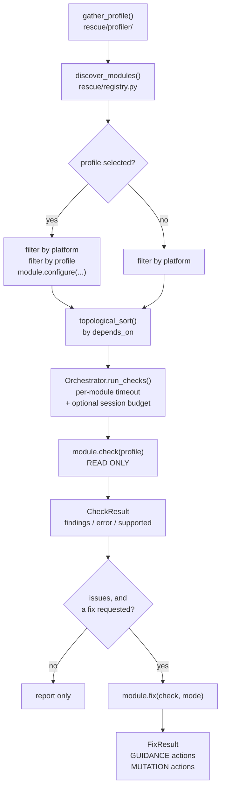

# Architecture

How a scan actually runs, and where everything lives. If you are about to write
a module, read this first and [Writing a module](writing-a-module.md) second.

## The shape of a scan



### 1. Profiling — what machine is this?

`rescue.profiler.base.gather_profile()` dispatches to `darwin.py`,
`windows.py`, or `linux.py` and returns a `SystemProfile`: platform, OS name
and version, architecture, CPU model and core count, RAM, disks, processes,
startup items, installed software, hostname.

Every module's `check()` receives this object. That matters for testability —
a module that reads platform and process state from the profile rather than
calling `platform.system()` itself can be tested by handing it a fabricated
profile.

### 2. Discovery — what checks exist?

`rescue.registry.discover_modules(modules_dir)` walks
`modules/<category>/<name>/__init__.py`, loads each with `importlib` under a
synthetic `rescue_modules.<name>` name, and instantiates the class named
`Module` if it subclasses `ModuleBase`. Directories starting with `_` are
skipped, and a directory whose `__init__.py` defines no `Module` class is
skipped silently — that is how shared helpers like `modules/network/lan_common/`
live in the tree without being mistaken for checks.

A module that raises on import is logged and skipped. One broken module does
not break discovery.

!!! note "Discovery executes module code"
    Loading a module runs its top-level statements. This is roadmap P0#10 and
    is called out in [Trust and safety](trust-and-safety.md#where-the-guarantees-are-partial).

### 3. Selection — which checks run?

Two filters, in this order:

1. **Platform.** `filter_by_platform` drops any module that does not list the
   current platform in `platforms`. This is the coarse filter; a module may
   *also* return `supported=False` at runtime for a finer reason (a missing
   command, an unreadable path).
2. **Profile,** if one was named. `filter_modules_by_profile` keeps the
   profile's `include` list and drops its `exclude` list, then
   `module.configure(profile.module_config.get(name, {}))` hands each surviving
   module its profile-specific settings. That is how
   `iphone_spyware_check` turns on the backup scan that is off everywhere else.

Then `topological_sort` orders modules so that anything named in `depends_on`
runs first.

### 4. Orchestration — bounds

`rescue.orchestrator.Orchestrator` is the only place a scan is bounded.

- **Per-module timeout**, `DEFAULT_MODULE_TIMEOUT = 60.0` seconds. Each
  `check()` runs on a daemon thread; if it overruns, the thread is *abandoned*
  and the module records `error="timed out after 60.0s"`. Python cannot kill a
  thread stuck in a blocking syscall, so abandoning it is what bounds the
  session even when the individual command cannot be interrupted.
- **Optional total session budget.** Once exhausted, remaining modules record
  `error="skipped: session time budget exhausted"` rather than being silently
  dropped.
- **Exception isolation.** A `check()` that raises becomes
  `CheckResult(error=str(exc))`. The scan continues.

`run_fixes` then applies the auto-mode gate described in
[Trust and safety](trust-and-safety.md#auto-mode-is-read-only), and `run_auto`
combines both into `(module, check, fix_or_None)` triples.

### 5. Results — the vocabulary

```python
CheckResult(
    module_name = "linux_firewall_check",
    findings    = [Finding(...), ...],
    error       = None,          # set if check() raised or timed out
    supported   = True,          # False when the check cannot run here
    unsupported_reason = None,
)
```

`CheckResult.status` collapses those into one of four values, and the whole
point is that they never collapse into each other:

| `CheckStatus` | Meaning |
| --- | --- |
| `HEALTHY` | Ran, found nothing. |
| `ISSUES` | Ran, has findings. |
| `FAILED` | Raised or timed out. **Not** a clean result. |
| `UNSUPPORTED` | Could not run here — wrong platform, missing tool, no permission. **Not** a clean result. |

A `Finding` carries `title`, `description`, `severity`
(`info`/`warning`/`critical`), `category`, a free-form `data` dict, optional
`confidence` and `collected_at` evidence metadata, and an optional `code`.

The `code` is the join key for the whole remediation system. Its scheme is
`<category>.<module>.<slug>`, e.g.
`security.linux_firewall_check.no_firewall`, and it links a finding to a
walkthrough in `guides/remediation/`. Modules declare every code they can emit
in `emits_codes`, which is what makes
[the remediation catalog](REMEDIATION_CATALOG.md) and
[the threat map](THREAT_REMEDIATION.md) generatable and checkable.

### 6. Fixes — guidance versus mutation

`fix()` returns a `FixResult` holding `Action` objects, and each action declares
its `kind`:

- **`ActionKind.GUIDANCE`** — instructions for a human. "Open System Settings
  → General → Software Update and turn on automatic updates." Nothing was done
  to the machine. Most actions in this tree are guidance, on purpose: the
  things that matter most in a compromise (changing account passwords, revoking
  sessions, freezing credit) happen at a provider, not on the device.
- **`ActionKind.MUTATION`** — a change to the system. Carries `executed`,
  `success`, and `error`, and only counts as a change when
  `executed and success`.

`FixResult.executed_mutations` and `FixResult.guidance_actions` are what every
summary and report counts, so guidance can never be presented as a change that
was made.

## Repository layout

```text
multiverse-device-rescue/
├── rescue/                     # the Python package — the engine
│   ├── cli.py                  # every command and flag (Click)
│   ├── models.py               # SystemProfile, CheckResult, Finding, Action, enums
│   ├── module_base.py          # the ModuleBase contract modules implement
│   ├── registry.py             # discovery, platform filter, topological sort
│   ├── orchestrator.py         # timeouts, session budget, the auto-mode gate
│   ├── profiles.py             # loading profiles/*.yaml, selection, validation
│   ├── guides.py               # parsing guides/**/*.md front matter and steps
│   ├── session.py              # ~/.rescue/sessions — guide progress
│   ├── case.py                 # the redacted rescue-case export
│   ├── validate.py             # whole-catalog validation (rescue validate)
│   ├── serialize.py            # scan --json
│   ├── command.py              # bounded subprocess runner (timeout + output cap)
│   ├── fsbounds.py             # bounded filesystem traversal
│   ├── runtime.py              # bundled vs installed vs updated content paths
│   ├── remediation.py          # builds the remediation catalog
│   ├── threat_map.py           # builds the threat-remediation map
│   ├── profiler/               # per-platform SystemProfile collection
│   ├── security/               # integrity manifest, trusted signers
│   ├── update/                 # signed content updates (repo, verify, engine)
│   ├── ai/                     # optional AI layer (providers, explainer)
│   └── tui/                    # the Textual terminal UI
├── modules/<category>/<name>/  # the checks — one directory each
│   └── __init__.py             #   defines `class Module(ModuleBase)`
├── profiles/*.yaml             # the seven built-in scenarios
├── guides/<profile>/phase_N.md # phased human walkthroughs
├── guides/remediation/*.md     # per-finding-code remediation walkthroughs
├── tests/                      # pytest suite, one file per module by convention
├── scripts/                    # release and docs generation tooling
├── desktop/                    # Electron desktop shell
├── shared/                     # data shared between the CLI and the desktop app
├── docs/                       # this documentation site
└── site/                       # the separate marketing landing page
```

### Categories

`modules/` has five category directories, and a module's `category` attribute
must match the directory it lives in:

| Category | What belongs there |
| --- | --- |
| `security` | Malware and spyware indicators, persistence, remote access, credential exposure, hardening posture. |
| `integrity` | Whether the machine's own subsystems are healthy: disks, updates, backups, drivers, logs, keychains, network stacks. |
| `performance` | Why it is slow: CPU, memory, thermals, disk space, startup load. |
| `network` | The local network and this machine's place on it. |
| `bloatware` | Preinstalled and vendor software nobody asked for. |

Counts per category and per platform are in the [module catalog](modules.md).

### Content is data, not package code

`modules/`, `profiles/`, and `guides/` install **outside** the Python package,
as `data_files` under `share/multiverse-device-rescue/` (see `setup.py`).
`rescue.runtime` resolves them at runtime in this order:

1. A PyInstaller bundle's extraction directory, if frozen.
2. The source checkout, if `modules/` sits next to the `rescue/` package.
3. `$RESCUE_ASSETS_DIR`, if set.
4. The installed share directory.

On top of that, `content_directory()` and `content_file()` prefer an *applied*
content update in `~/.local/share/rescue/content/` — but only after
`rescue update` has verified signatures and written the
`.git/rescue-applied-head` marker. A fetched-but-unapproved checkout is never
used.

This split is why CI has a dedicated job that installs into a clean virtualenv
and runs the tool from a different directory: a packaging mistake here produces
a tool that installs cleanly, launches cleanly, and discovers nothing.

## Profiles and guides

A **profile** (`profiles/<name>.yaml`) is a scenario. It names the modules to
include, per-module configuration, and the guide sets that belong to it:

```yaml
name: home_for_the_holidays
display_name: "Home for the Holidays"
description: >
  Help a family member get their device cleaned up ...
modules:
  include: [disk_space, disk_smart_check, malware_scan_indicators, automatic_updates]
  exclude: []
module_config:
  disk_space:
    sensitivity: normal
guides:
  - home_for_the_holidays
```

A **guide** is a directory of `phase_N.md` files with YAML front matter:

```yaml
---
profile: identity_theft_recovery
phase: 1
title: "Make Sure The Device Is Not The Leak"
automatable_steps: [1, 2, 3]
human_only_steps: [4, 5]
estimated_time: "45 minutes"
---

## Step 1: Scan for monitoring and malware on this device
...
```

`rescue.guides` parses the front matter and splits the body on `## Step N:`
headings. `rescue validate` enforces that a step listed in `automatable_steps`
actually exists — the project's rule is that a step may not be advertised as
automatable until it resolves to a registered module.

`guides/remediation/*.md` is a different shape: each walkthrough declares
`remediates: [<finding code>, ...]`, and the UI offers it when a finding
carries a matching code. A walkthrough whose codes no module emits is dead
content, and `rescue validate` warns about it.

## Testing conventions

The suite mirrors the tree: `tests/test_module_<module_name>.py` per module,
plus `tests/test_all_shipped_content.py`, which validates every shipped profile
and guide against the live registry.

Module tests load through the real registry rather than importing the file
directly:

```python
def _get_module():
    modules = discover_modules(Path(__file__).parent.parent / "modules")
    return next(m for m in modules if m.name == "linux_firewall_check")
```

That is deliberate: modules are loaded under a synthetic `rescue_modules.*`
name that is not an importable package, so `patch("rescue_modules.x.run")`
cannot resolve. Patch the loaded module object instead. Tests must never touch
the network or the real home directory; CI sets `RESCUE_TEST_MODE=1`.
